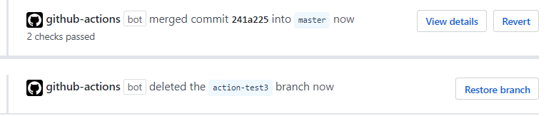
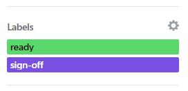
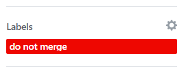

# PR Merge Bot

This action manages pull request integrations by allowing a structured workflow to be defined.

The workflow can use required labels, blocking labels, and require that reviewers sign-off for determining if a pull request should be integrated. By default the pull request will be blocked by incomplete/failing checks.

Once conditions are met the pull request will be integrated and branch deleted.



## Inputs

### `test`

Runs in test mode and will comment rather than merge. This allows you to experiment with the settings without integrating a pull request. Default is `false`.


### `reviewers`

Reviewers required, and reviewers must all approve. This enforces a reviewer mode where there cannot be any pending reviews and the submitted reviews must be in an "approved" state. Default is `true`.


### `labels`

One or more labels required for integration. Default is `"ready"`.



### `blocking-labels`

One or more labels that block the integration. Default is `"do not merge"`.



### `checks_enabled`

All checks must be completed to be eligible to integrate. Default is `true`.

### `method`

Merge method to use. Possible values are `merge`, `squash` or `rebase`. Default is `merge`.

## Example usage

You can use PR Merge Bot by configuring a YAML-based workflow file, e.g. `.github/workflows/merge-bot.yml`.

```yaml
name: Merge Bot

on:
  pull_request:
    types:
      - labeled
      - review_request_removed
      - review_requested
      - unlabeled
  pull_request_review:
    types:
      - dismissed
      - submitted
  status:

jobs:
  merge:
    runs-on: ubuntu-latest
    name: Merge
    steps:
    - name: Integration check
      uses: squalrus/merge-bot@v0.2.0
      with:
        GITHUB_TOKEN: ${{ secrets.GITHUB_TOKEN }}
        test: true
        reviewers: true
        labels: ready, merge
        blocking-labels: do not merge
        checks: true
        method: squash
```
