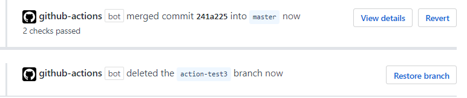
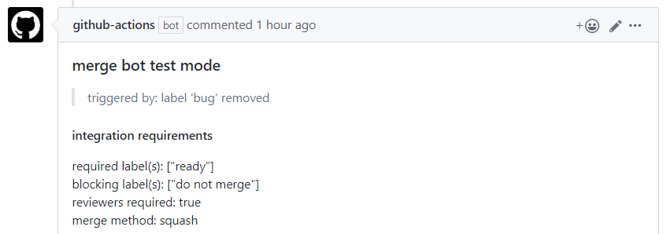
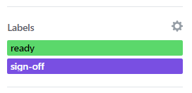
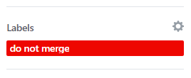
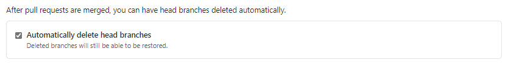

# PR Merge Bot


[](https://github.com/squalrus/merge-bot/actions/workflows/test.yml)

This action manages pull request integrations by allowing a structured workflow to be defined.

The workflow can use required labels, blocking labels, and require that reviewers sign-off for determining if a pull request should be integrated. By default the pull request will be blocked by incomplete/failing checks.

Once conditions are met the pull request will be integrated and branch deleted.



## Inputs

### `test`

Runs in test mode and will comment rather than merge. This allows you to experiment with the settings without integrating a pull request. Default is `false`.



### `reviewers`

Reviewers required, and reviewers must all approve. This enforces a reviewer mode where there cannot be any pending reviews and the submitted reviews must be in an "approved" state. Default is `true`.


### `labels`

One or more labels required for integration. Default is `"ready"`.



### `blocking_labels`

One or more labels that block the integration. Default is `"do not merge"`.



### `checks_enabled`

All checks must be completed to be eligible to integrate (this does not include the currently running Action). Note, if triggering multiple runs simultaneously (like adding two labels) this will not pass -- USE WITH CAUTION. Default is `false`.

### `method`

Merge method to use. Possible values are `merge`, `squash` or `rebase`. Default is `merge`.

### `delete_source_branch`

Delete the source branch of the pull request after merging. Set to `false` when "Automatically delete head branches" is enabled on your repo. Default is `true`.

_NOTE: if enabled, merge-bot is unable to delete a branch from a fork._



## Example usage

You can use PR Merge Bot by configuring a YAML-based workflow file, e.g. `.github/workflows/merge-bot.yml`.

```yaml
name: Merge Bot

on:
  pull_request_target:
    types:
      - labeled
      - ready_for_review
      - review_request_removed
      - review_requested
      - synchronize
      - unlabeled
  pull_request_review:
    types:
      - dismissed
      - submitted
  check_suite:
    types:
      - completed

jobs:
  merge:
    if: github.event_name != 'check_suite' || github.event.check_suite.pull_requests[0] != null
    runs-on: ubuntu-latest
    name: Merge
    steps:
    - name: Integration check
      uses: squalrus/merge-bot@v0
      with:
        GITHUB_TOKEN: ${{ secrets.GITHUB_TOKEN }}
        test: true
        reviewers: true
        labels: ready, merge
        blocking_labels: do not merge
        checks_enabled: true
        method: squash
        delete_source_branch: true
```

`pull_request_target` (rather than `pull_request`) is required for merge-bot to work on pull requests from forks: GitHub always issues a read-only `GITHUB_TOKEN` for fork-originated `pull_request` events, which makes the actual merge fail even when merge-bot judges the PR mergeable. `pull_request_target` runs with your repo's normal token permissions instead. This is only safe because the workflow above never checks out or executes the fork's code — it just runs the trusted `merge-bot` action against webhook data. If you add a step that checks out `github.event.pull_request.head.sha` to this workflow, you'd be executing untrusted fork code with write access to your repo; don't do that here.

`check_suite: [completed]` is what lets merge-bot re-evaluate a PR the moment its checks finish, rather than waiting for some unrelated event (another push, a new review) to happen to retrigger it — the usual gap when `checks_enabled: true` and a check runs longer than the PR's other requirements take to satisfy. A check suite fires for every commit in the repo, not just ones tied to open PRs, so its payload lists the (possibly empty) set of pull requests it's associated with; merge-bot fetches and re-evaluates each one in full. The job's `if` above skips runs with no associated pull request so they don't spend a runner for nothing.

### Retrying via a PR comment

Merging can occasionally fail with a transient `Base branch was modified` error (typically when multiple merge-bot runs land close together). To let a comment on the pull request re-trigger evaluation, add `issue_comment` to the workflow's triggers, guarding the job so it only runs for comments on pull requests (`issue_comment` also fires for comments on plain issues, which have no pull request to evaluate):

```yaml
on:
  issue_comment:
    types:
      - created

jobs:
  merge:
    if: github.event.issue.pull_request
    runs-on: ubuntu-latest
    ...
```

If you're combining this with the `check_suite` trigger above, `&&` the two conditions together rather than adding a second `if:` key (YAML keeps only the last one):

```yaml
if: (github.event_name != 'issue_comment' || github.event.issue.pull_request) && (github.event_name != 'check_suite' || github.event.check_suite.pull_requests[0] != null)
```

## Development

```bash
npm install
npm test
```

Tests live in `__tests__/` and use fixture payloads from `__mocks__/`.

The action itself runs from a bundled `dist/index.js`, generated from `index.js` and `lib/` with [`@vercel/ncc`](https://github.com/vercel/ncc) — that's what [`action.yml`](action.yml) points at. After changing `index.js` or anything under `lib/`, rebuild and commit the result:

```bash
npm run build
```

A CI check ([`.github/workflows/build-check.yml`](.github/workflows/build-check.yml)) fails the PR if `dist/` is out of date with source.

## Upgrading

Pinned to an old version? See [MIGRATION.md](MIGRATION.md) for what changed since `v0.4.5` and what (if anything) you need to update in your workflow.

## Contributing

Bug reports, feature requests, and pull requests are welcome. See [CONTRIBUTING.md](CONTRIBUTING.md) for the workflow, and [CLAUDE.md](CLAUDE.md) if you're working in this repo with Claude Code.

## Project status

This repo currently has open items around its GitHub Actions runtime version, dependency freshness, and open PR triage — see [AUDIT.md](AUDIT.md) for a full health check and [BACKLOG.md](BACKLOG.md) for tracked follow-up work.

## License

[MIT](LICENSE)
